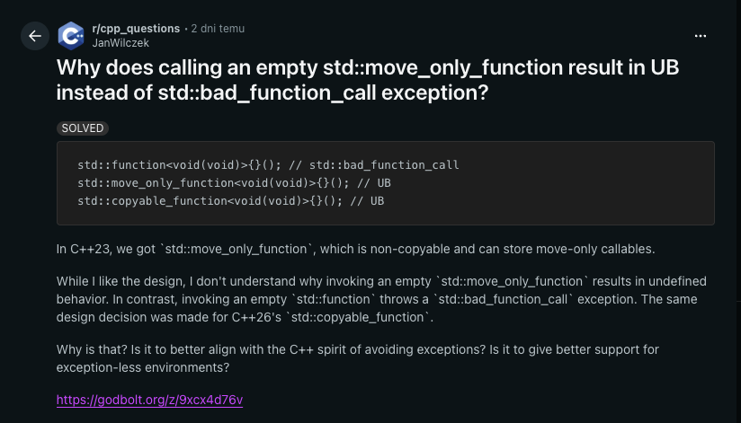

# C++ Function Wrappers

## Jan Wilczek (thinkcell)

Berlin, Sep 28, 2026

---


---

# Fast & Furious

<div class="flex items-start gap-8">
  <div class="flex flex-col gap-6">
    
    
    
  </div>
  
</div>

---

# Fast & `std::function`

<v-clicks>

- `std::function`
- `std::move_only_function` (C++23)
- `std::function_ref` (C++26)
- `std::copyable_function` (C++26)

</v-clicks>

<v-drag-arrow v-click pos="206,203,-35,-73"/>

---

# Outline

---

# Motivating Example: Logger

````md magic-move
```cpp
void doStuff() {
    // do stuff
}
```
```cpp
void doStuff() {
    // do stuff
    std::println("Stuff done.");
}
```
```cpp {all|1|3-6|8-10|11}
using Logger = void (*)(std::string_view);

void doStuff(Logger log) {
    // do stuff
    log("Stuff done.");
}

auto logger = [](std::string_view str) {
    std::println("Message: {}", str);
};
doStuff(logger);
```
```cpp {8-11|12}
using Logger = void (*)(std::string_view);

void doStuff(Logger log) {
    // do stuff
    log("Stuff done.");
}

auto logger = [i = 0](std::string_view str) mutable {
    std::println("Message {}: {}", i, str);
    ++i;
};
doStuff(logger);
```
```cpp {12|all}
using Logger = void (*)(std::string_view);

void doStuff(Logger log) {
    // do stuff
    log("Stuff done.");
}

auto logger = [i = 0](std::string_view str) mutable {
    std::println("Message {}: {}", i, str);
    ++i;
};
doStuff(logger); // ❌
```
```cpp {all|1|10}
void doStuff(std::function<void(std::string_view)> log) {
    // do stuff
    log("Stuff done.");
}

auto logger = [i = 0](std::string_view str) mutable {
    std::println("Message {}: {}", i, str);
    ++i;
};
doStuff(logger); // ✅
```
````

---

# `std::function`


<v-clicks>

- passing callables without specifying their type
- functions as first-class objects
- dependency injection (Strategy)
- callbacks (Observer, GUI, threads, async operations)
- deferred execution
- algorithms
- ABI stability

</v-clicks>

---

# `std::function`

https://godbolt.org/z/nG7ME146d

````md magic-move
```cpp
void doStuff(std::function<void(std::string_view)> log) {
    // do stuff
    log("Stuff done.");
}

auto logger = [i = 0](std::string_view str) mutable {
    std::println("Message {}: {}", i, str);
    ++i;
};
doStuff(logger);
```
```cpp
void doStuff(std::function<void(std::string_view)> log) {
    // do stuff
    log("Stuff done.");
}

auto logger = [i = 0](std::string_view str) mutable {
    std::println("Message {}: {}", i, str);
    ++i;
};
doStuff(logger);
doStuff(logger);
```
```cpp {all|1|all}
void doStuff(std::function<void(std::string_view)> log) {
    // do stuff
    log("Stuff done.");
}

auto logger = [i = 0](std::string_view str) mutable {
    std::println("Message {}: {}", i, str);
    ++i;
};
doStuff(logger); // Message 0: Stuff done.
doStuff(logger); // Message 0: Stuff done.
```
```cpp {all|1|6-9|10-11}
void doStuff(const std::function<void(std::string_view)>& log) {
    // do stuff
    log("Stuff done.");
}

auto logger = std::function{[i = 0](std::string_view str) mutable {
    std::println("Message {}: {}", i, str);
    ++i;
}};
doStuff(logger);
doStuff(logger);
```
```cpp {10-11|all|1,6,8}
void doStuff(const std::function<void(std::string_view)>& log) {
    // do stuff
    log("Stuff done.");
}

auto logger = std::function{[i = 0](std::string_view str) mutable {
    std::println("Message {}: {}", i, str);
    ++i;
}};
doStuff(logger); // Message 0: Stuff done.
doStuff(logger); // Message 1: Stuff done.
```
````

---

# `std::function`: Problem 1 ("constness bug")

https://godbolt.org/z/vKsd8cPe3

````md magic-move
```cpp {all|1-4|5-6|all}
auto f = std::function{[i = 0] mutable {
    ++i;
    std::println("i={}", i);
}};
const auto& fref = f;
fref(); // i=1 ⚠️
```
```cpp
auto f = std::move_only_function{[i = 0] mutable {
    ++i;
    std::println("i={}", i);
}};
const auto& fref = f;
fref(); // ❌
```
````

[N4159](https://wg21.link/n4159)

<!-- copyable_function is still not available in MSVC -->

---

# "Awesome" logger

https://godbolt.org/z/xK5bK7vxo

````md magic-move
```cpp {all|7-10|1-5|12|3,7,12-13}
namespace awe {
struct AwesomeLogger {
    void log(std::string_view) & { /* ... */ }
};
}

void doStuff(std::function<void(std::string_view)>& log) {
    // do stuff
    log("Stuff done.");
}

auto logger = std::make_unique<awe::AwesomeLogger>();
doStuff(/* ? */);
```
```cpp {7,12-16}
namespace awe {
struct AwesomeLogger {
    void log(std::string_view) & { /* ... */ }
};
}

void doStuff(std::function<void(std::string_view)>& log) {
    // do stuff
    log("Stuff done.");
}

auto logger = std::function{
        [logger = std::make_unique<awe::AwesomeLogger>()] (std::string_view str) {
    logger->log(str);
}};
doStuff(logger);
```
```cpp {7,12-16}
namespace awe {
struct AwesomeLogger {
    void log(std::string_view) & { /* ... */ }
};
}

void doStuff(std::function<void(std::string_view)>& log) {
    // do stuff
    log("Stuff done.");
}

auto logger = std::function{
        [logger = std::make_unique<awe::AwesomeLogger>()] (std::string_view str) {
    logger->log(str);
}}; // ❌
doStuff(logger);
```
```cpp {7,12-16}
namespace awe {
struct AwesomeLogger {
    void log(std::string_view) & { /* ... */ }
};
}

void doStuff(std::move_only_function<void(std::string_view)>& log) {
    // do stuff
    log("Stuff done.");
}

auto logger = std::move_only_function<void(std::string_view)>>{
        [logger = std::make_unique<awe::AwesomeLogger>()] (std::string_view str) {
    logger->log(str);
}}; // ✅
doStuff(logger);
```
````

---

# `std::move_only_function`


<v-clicks>

- C++23
- non-copyable
- allows move-only callables
- allows copyable callables
- const-correct
- fixes a few more problems of `std::function`...

</v-clicks>

---

# `std::function`: Problem 2

https://godbolt.org/z/WzsfjGrev

````md magic-move
```cpp
auto f = std::function<void(void)>{[i = 0] {
    std::println("i={}", i);
}};
const auto& fref = f;
fref(); // ✅
```
```cpp
auto f = std::move_only_function<void(void) const>{[i = 0] {
    std::println("i={}", i);
}};
const auto& fref = f;
fref(); // ❌
```

````

---

# `std::function`: Problem 3

````md magic-move
```cpp
std::function<void(void)> f = [i = 0] noexcept { // ✅
    std::println("i={}", i);
};
```
```cpp
std::move_only_function<void(void)> f = [i = 0] noexcept { // ❌
    std::println("i={}", i);
};
```
```cpp
std::copyable_function<void(void)> f = [i = 0] noexcept { // ❌
    std::println("i={}", i);
};
```
```cpp
std::copyable_function<void(void) noexcept> f = [i = 0] noexcept { // ✅
    std::println("i={}", i);
};
```
````

---

# References & and &&
---

# `tc::move_only_function`

---

# Limitation of `std::move_only_function`

````md magic-move
```cpp
auto f = std::move_only_function<void(void) const noexcept> {[i = 0] noexcept {
    std::println("i={}", i);
}};
const auto g = f; // ❌
```
```cpp
auto f = std::copyable_function<void(void) const noexcept>{[i = 0] noexcept {
    std::println("i={}", i);
}};
const auto g = f; // ✅
```
````

---

# `std::copyable_function`

<div />

$\iff$ `std::move_only_function` + 

<v-clicks>

- copy constructor
- copy assignment operator
- callables must be copy-constructible

</v-clicks>

---

# Multithreaded logger

````md magic-move
```cpp {all|6-9}
void doStuff(const std::move_only_function<void(std::string_view)>& log) {
    // do stuff
    log("Stuff done.");
}

auto logger = [logger = std::make_unique<awe::AwesomeLogger>()] (std::string_view str) {
    logger->log(str);
};
doStuff(logger);
```
```cpp {6-10}
void doStuff(const std::move_only_function<void(std::string_view)>& log) {
    // do stuff
    log("Stuff done.");
}

LoggerQueue queue{std::make_unique<awe::AwesomeLogger>()};
auto logger = [&queue] (std::string_view str) {
    queue.push(str);
};
doStuff(logger);
```
```cpp {6-10}
void doStuff(const std::move_only_function<void(std::string_view)>& log) {
    // do stuff
    log("Stuff done.");
}

LoggerQueue queue{std::make_unique<awe::AwesomeLogger>()};
auto logger = [&queue, mutex = std::mutex{}] (std::string_view str) {
    std::lock_guard lock{mutex};
    queue.push(str);
};
doStuff(logger);
```
```cpp {6-10|all}
void doStuff(const std::move_only_function<void(std::string_view)>& log) {
    // do stuff
    log("Stuff done.");
}

LoggerQueue queue{std::make_unique<awe::AwesomeLogger>()};
auto logger = [&queue, mutex = std::mutex{}] (std::string_view str) {
    std::lock_guard lock{mutex};
    queue.push(str);
};
doStuff(logger); // ❌
```
```cpp {6-10}
void doStuff(const std::function_ref<void(std::string_view)>& log) {
    // do stuff
    log("Stuff done.");
}

LoggerQueue queue{std::make_unique<awe::AwesomeLogger>()};
auto logger = [&queue, mutex = std::mutex{}] (std::string_view str) {
    std::lock_guard lock{mutex};
    queue.push(str);
};
doStuff(logger); // ✅
```
```cpp {6-10}
void doStuff(std::function_ref<void(std::string_view)> log) {
    // do stuff
    log("Stuff done.");
}

LoggerQueue queue{std::make_unique<awe::AwesomeLogger>()};
auto logger = [&queue, mutex = std::mutex{}] (std::string_view str) {
    std::lock_guard lock{mutex};
    queue.push(str);
};
doStuff(logger); // ✅
```
````

---

# `std::function_ref`


<v-clicks>

- Non-owning callable wrapper
- Does for functions the same job as `std::string_view` for `std::string`

</v-clicks>

---

# Composite logger

````md magic-move
```cpp
struct CountingLogger {
    CountingLogger(std::function<void(std::string_view)> logger)
        : m_logger(std::move(logger)) {}

    void operator()(std::string_view str) {
        ++m_i;
        m_logger(str);
    }

private:
    std::function<void(std::string_view)> m_logger;
    int m_i;
};
```
```cpp
struct CountingLogger {
    CountingLogger(std::function_ref<void(std::string_view)> logger)
        : m_logger(std::move(logger)) {}

    void operator()(std::string_view str) {
        ++m_i;
        m_logger(str);
    }

private:
    std::function_ref<void(std::string_view)> m_logger;
    int m_i;
};
```
```cpp
struct CountingLogger {
    CountingLogger(std::function_ref<void(std::string_view)> logger)
        : m_logger(std::move(logger)) {}
//...
private:
    std::function_ref<void(std::string_view)> m_logger;
    int m_i;
};

CountingLogger logger{[](std::string_view str) {
    std::println("{}", str);
}};
doStuff(logger);
```
```cpp {all|10-12}
struct CountingLogger {
    CountingLogger(std::function_ref<void(std::string_view)> logger)
        : m_logger(std::move(logger)) {}
//...
private:
    std::function_ref<void(std::string_view)> m_logger;
    int m_i;
};

CountingLogger logger{[](std::string_view str) {
    std::println("{}", str);
}};
doStuff(logger); // disaster 💀
```
````

---

# `tc::function_ref`


---
layout: center
---

# Further differences from `std::function`

---

# It does not have the target_type and target accessors (direction requested by users and implementors).

---

# "Invocation has strong preconditions"

https://godbolt.org/z/8b5fMbaoe

```cpp {all|1|2-3|4}
std::function<void(void)>{}(); // std::bad_function_call
std::move_only_function<void(void)>{}(); // UB
std::copyable_function<void(void)>{}(); // UB
std::function_ref<void(void)>{}(); // ❌
```

---

# "Invocation has strong preconditions"

## Why? 🤔

<v-click>

https://www.reddit.com/r/cpp_questions/s/yxX2MXa4Yy



</v-click>

---

# "Invocation has strong preconditions"

## Why? 🤔

<v-click>

- Invoking an empty `std::function` is a bug

</v-click>
<v-click>

- Implementations can now assert on this

</v-click>

<v-click>

- "Don't pay for what you don't use"

</v-click>
<v-click>

- Exceptionless environments

</v-click>
<v-click>

- `noexcept` propagation
```cpp
std::throwing_move_only_function<void(void) noexcept> f;
f(); // throws despite noexcept
f = [] noexcept { /* ... */ };
```

</v-click>

---
layout: center
---

> I guess Java/C#/Go wasn't getting enough backend projects and Rust wasn't getting enough low level work. Gotta take the opportunity to make C++ just a little more unsafe and make sure even the most up-to-date C++ still has a mountain of gotchas baked in. Don't worry; I'm sure there will be a safety profile for that later. (Yeah right.)

> The language is too big to die, but not for lack of trying. The C++ language development strategy at this is to pretty much fiddle while Rome burns basically.

---

# Conversions?


---

# Summary: `std::function` problems

<v-clicks>

- binds non-const callables to const refs
- disallows move-only callables
- disallows non-movable, non-copyable callables
- does not propagate `const`, `noexcept`, `&`, or `&&` to `operator()`
- throws `std::bad_function_call`

</v-clicks>

---
layout: center
---

# Will `std::function` be deprecated?

---
layout: center
---

# Probably not 🙃

<v-click>

## But there is a proposal for it: [P2721](https://wg21.link/P2721)

</v-click>

---

# Summary

<v-clicks>

- function pointers and STL function wrappers are great solutions for dependency inversion and callbacks
- use `std::move_only_function` (C++23) if your function wrapper doesn't have to be copied or the callable cannot be copied
- use `std::function_ref` (C++26) if you don't need to store the function wrapper or the callable cannot be moved
- use `std::copyable_function` for a copyable function wrapper
- `std::copyable_function` $\iff$ `std::move_only_function` + 
    - copy constructor
    - copy assignment operator
    - callables must be copy-constructible
- avoid `std::function`
- never call an empty function wrapper (UB)

</v-clicks>

<!-- function_ref is for a callable as string_view for string. std::copyable_function = std::function v2 -->
